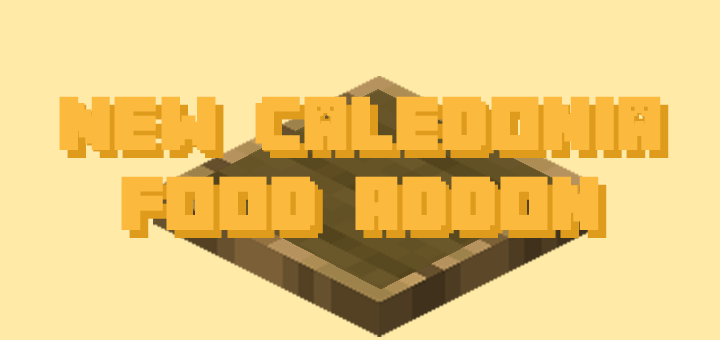

<html lang="en">

<head>
    <meta charset="UTF-8">
    <meta http-equiv="X-UA-Compatible" content="IE=edge">
    <meta name="viewport" content="width=device-width, initial-scale=1.0">
    <title>New Caledonia Addons</title>

    <link href="css/bootstrap.min.css" rel="stylesheet">
    <link href="css/style.css" rel="stylesheet">
    

    <!--Favicon Information-->
    <link rel="apple-touch-icon" sizes="180x180" href="{{ "addons/favicon/apple-touch-icon.png" | absolute_url }}">
    <link rel="icon" type="image/png" sizes="32x32" href="{{ "addons/favicon/favicon-32x32.png" | absolute_url }}">
    <link rel="icon" type="image/png" sizes="16x16" href="{{ "addons/favicon/favicon-16x16.png" | absolute_url }}">
    <link rel="manifest" href="{{ "addons/favicon/site.webmanifest" | absolute_url }}">
    <link rel="mask-icon" href="{{ "addons/favicon/safari-pinned-tab.svg" | absolute_url }}" color="#3c728c">
    <link rel="shortcut icon" href="{{ "addons/favicon/favicon.ico" | absolute_url }}">
    <meta name="msapplication-TileColor" content="#000000">
    <meta name="msapplication-TileImage" content="{{ "addons/favicon/mstile-144x144.png" | absolute_url }}">
    <meta name="msapplication-config" content="{{ "addons/favicon/browserconfig.xml" | absolute_url }}">
    <meta name="theme-color" content="#3c728c">

    <!-- Primary Meta Tags -->
    <title>New Caledonia Addons</title>
    <meta name="title" content="New Caledonia Addons">
    <meta name="description" content="All Official New Caledonia Addons Available Here">

    <!-- Open Graph / Facebook -->
    <meta property="og:type" content="website">
    <meta property="og:url" content="{{ "/addons/" | absolute_url }}">
    <meta property="og:title" content="New Caledonia Addons">
    <meta property="og:description" content="All Official New Caledonia Addons Available Here">
    <meta property="og:image" content="{{ "/addons/favicon/android-chrome-512x512.png" | absolute_url }}">

    <!-- Twitter -->
    <meta property="twitter:card" content="summary_large_image">
    <meta property="twitter:url" content="{{ "/addons/" | absolute_url }}">
    <meta property="twitter:title" content="New Caledonia Addons">
    <meta property="twitter:description" content="All Official New Caledonia Addons Available Here">
    <meta property="twitter:image" content="{{ "/addons/favicon/android-chrome-512x512.png" | absolute_url }}">
</head>

<body>
    

        

            <h1 class="header">New Caledonia Addons</h1>
        

    

    

        

            

                
                

                    <h5 class="card-title">Credits Addon</h5>
                    
New Caledonia Official Currency Addon

                    

                        

                            

                                <a href="https://newcaledoniadevteam.github.io/CreditsAddon/docs/" class="btn btn-secondary">Docs</a>
                                <a href="https://github.com/NewCaledoniaDevTeam/CreditsAddon/releases" class="btn btn-secondary">Download</a>
                            

                        

                    

                

            

            

                
                

                    <h5 class="card-title">Food Addon</h5>
                    
New Caledonia Official Food Addon

                    

                        

                            

                                <a href="https://newcaledoniadevteam.github.io/FoodAddon/docs/" class="btn btn-secondary">Docs</a>
                                <a href="https://github.com/NewCaledoniaDevTeam/FoodAddon/releases" class="btn btn-secondary">Download</a>
                            

                        

                    

                

            

            

                
                

                    <h5 class="card-title">Compressed Cobblestone</h5>
                    
Cobblestone but compressed

                    

                        

                            

                                <a href="https://newcaledoniadevteam.github.io/CompressedCobblestone/" class="btn btn-secondary">Docs</a>
                                <a href="https://github.com/NewCaledoniaDevTeam/CompressedCobblestone/releases" class="btn btn-secondary">Download</a>
                            

                        

                    

                

            

            
            

                
                

                    <h5 class="card-title">Border Addon</h5>
                    
New Caledonia Border Addon

                    

                        

                            

                                <a href="https://newcaledoniadevteam.github.io/BorderAddon/docs/" class="btn btn-secondary">Docs</a>
                                <a href="https://github.com/NewCaledoniaDevTeam/BorderAddon/releases" class="btn btn-secondary">Download</a>
                            

                        

                    

                

            

            
        

    

    <!-- ======= Footer ======= -->
    <footer id="footer">
        

            

                

                    <nav class="footer-links text-lg-right text-center pt-2 pt-lg-0">
                        
                         
                         
                    </nav>
                

            

        

    </footer>
    <!-- End Footer -->

</body>

</html>
