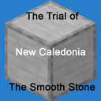

<html lang="en">

<head>
    <title>DLCs - New Caledonia Shader Downloads</title>
    <meta http-equiv="content-type" content="text/html; charset=UTF-8" />
    
    <!--Favicon Information-->
    <link rel="apple-touch-icon" sizes="180x180" href="{{ "/favicon/apple-touch-icon.png?v=21722" | absolute_url }}">
    <link rel="icon" type="image/png" sizes="32x32" href="{{ "/favicon/favicon-32x32.png?v=21722" | absolute_url }}">
    <link rel="icon" type="image/png" sizes="194x194" href="{{ "/favicon/favicon-194x194.png?v=21722" | absolute_url }}">
    <link rel="icon" type="image/png" sizes="192x192" href="{{ "/favicon/android-chrome-192x192.png?v=21722" | absolute_url }}">
    <link rel="icon" type="image/png" sizes="16x16" href="{{ "/favicon/favicon-16x16.png?v=21722" | absolute_url }}">
    <link rel="manifest" href="{{ "/favicon/site.webmanifest?v=21722" | absolute_url }}">
    <link rel="mask-icon" href="{{ "/favicon/safari-pinned-tab.svg?v=21722" | absolute_url }}" color="#ca5a4f">
    <link rel="shortcut icon" href="{{ "/favicon/favicon.ico?v=21722" | absolute_url }}">
    <meta name="msapplication-TileColor" content="#000000">
    <meta name="msapplication-TileImage" content="{{ "/favicon/mstile-144x144.png?v=21722" | absolute_url }}">
    <meta name="msapplication-config" content="{{ "/favicon/browserconfig.xml?v=21722" | absolute_url }}">
    <meta name="theme-color" content="#ca5a4f">

    <meta charset="utf-8">
    <meta name="viewport" content="width=device-width, initial-scale=1">
    <meta name="title" content="Shader Download - New Caledonia">
    <meta name="description" content="Download the New Caledonia BETA Shader Pack with DLC!">
    
    <link href="https://cdn.jsdelivr.net/npm/bootstrap@5.0.0-beta1/dist/css/bootstrap.min.css" rel="stylesheet" integrity="sha384-giJF6kkoqNQ00vy+HMDP7azOuL0xtbfIcaT9wjKHr8RbDVddVHyTfAAsrekwKmP1" crossorigin="anonymous">
    <link href="../css/style.css" rel="stylesheet">
    <link rel="stylesheet" href="../css/colormode.css" />
    
    
</head>

<body>
    <!-- Page Preloder -->
    

        

    

      
    <table class="tableRoot">
        <tr>
            <td class="header raindow">
                <!-- Title -->
                
                    
                
                <!-- Navigation -->
                
                    <a href="../">Downloads</a>
                    <a href="#">DLCs</a>
                    <!--<button id="darkToggle">Switch tolightdark mode</button>-->
                <a href="https://github.com/NewCaledoniaDevTeam/" target="_blank">GitHub</a>
                
            </td>
        </tr>
        <tr>
            <td class="content">
                <!-- Content -->
                
                    

                <!--Current Version XMAS-DLC-->
                <h2>XMAS DLC</h2>
                Minecraft Bedrock Christmas DLC For New Caledonia Shader Packs. New Caledonia Shader Pack Required.  
                <!-- Version -->
                <table class='downloadTable mainTable'>
                    <tr class='downloadLine downloadLineMain'>
                        <td class='colFile'>0.0.4 XMAS-DLC</td>
                        <td class='colDownload'><a href="https://github.com/NewCaledoniaDevTeam/XMAS-DLC/releases/tag/0.0.4" target="_blank">Download</a></td>
                        <td class='colMirror'><a href="https://github.com/NewCaledoniaDevTeam/XMAS-DLC/releases/download/0.0.4/XMAS.DLC.0.0.4.mcpack" target="_blank">mcpack</a></td>
                        <td class='colMedia'><a href="https://github.com/NewCaledoniaDevTeam/XMAS-DLC/releases/download/0.0.4/XMAS.DLC.0.0.4.zip" target="_blank">zip</a></td>
                        <td class="colChangelog"><a href="https://github.com/NewCaledoniaDevTeam/XMAS-DLC/blob/main/changelog.md#004---2020-11-25" target="_blank">Changelog</a></td>
                        <td class="colDate">11/25/20</td>
                    </tr>
                </table>
                <!-- Older Verisons of XMAS-DLC-->
                <a class="spoilerLink" id="link.XMAS" href="javascript:showSpoiler('more.XMAS', 'link.XMAS', 'true');">+ More</a>
                

                    <table class='downloadTable'>
                        <tr class='downloadLine downloadLineMore'>
                            <td class='colFile'>0.0.3 XMAS-DLC</td>
                            <td class='colDownload'><a href="https://github.com/NewCaledoniaDevTeam/XMAS-DLC/releases/tag/0.0.3" target="_blank">Download</a></td>
                            <td class='colMirror'><a href="https://github.com/NewCaledoniaDevTeam/XMAS-DLC/releases/download/0.0.3/XMAS.DLC.0.0.3.mcpack" target="_blank">mcpack</a></td>
                            <td class='colMedia'><a href="https://github.com/NewCaledoniaDevTeam/XMAS-DLC/releases/download/0.0.3/XMAS.DLC.0.0.3.zip" target="_blank">zip</a></td>
                            <td class="colChangelog"><a href="https://github.com/NewCaledoniaDevTeam/XMAS-DLC/blob/main/changelog.md#003---2020-11-25" target="_blank">Changelog</a></td>
                            <td class="colDate">11/25/20</td>
                        </tr>
                        <tr class='downloadLine downloadLineMore'>
                            <td class='colFile'>0.0.2 XMAS-DLC</td>
                            <td class='colDownload'><a href="https://github.com/NewCaledoniaDevTeam/XMAS-DLC/releases/tag/0.0.2" target="_blank">Download</a></td>
                            <td class='colMirror'><a href="https://github.com/NewCaledoniaDevTeam/XMAS-DLC/releases/download/0.0.2/XMAS.DLC.0.0.2.mcpack" target="_blank">mcpack</a></td>
                            <td class='colMedia'><a href="https://github.com/NewCaledoniaDevTeam/XMAS-DLC/releases/download/0.0.2/XMAS.DLC.0.0.2.zip" target="_blank">zip</a></td>
                            <td class="colChangelog"><a href="https://github.com/NewCaledoniaDevTeam/XMAS-DLC/blob/main/changelog.md#002---2020-11-25" target="_blank">Changelog</a></td>
                            <td class="colDate">11/25/20</td>
                        </tr>
                        <tr class='downloadLine downloadLineMore'>
                            <td class='colFile'>0.0.1 XMAS-DLC</td>
                            <td class='colDownload'><a href="https://github.com/NewCaledoniaDevTeam/XMAS-DLC/releases/tag/0.0.1" target="_blank">Download</a></td>
                            <td class='colMirror'><a href="https://github.com/NewCaledoniaDevTeam/XMAS-DLC/releases/download/0.0.1/XMAS.DLC.0.0.1.mcpack" target="_blank">mcpack</a></td>
                            <td class='colMedia'><a href="https://github.com/NewCaledoniaDevTeam/XMAS-DLC/releases/download/0.0.2/XMAS.DLC.0.0.2.zip" target="_blank">zip</a></td>
                            <td class="colChangelog"><a href="https://github.com/NewCaledoniaDevTeam/XMAS-DLC/blob/main/changelog.md#001---2020-11-25" target="_blank">Changelog</a></td>
                            <td class="colDate">11/25/20</td>
                        </tr>
                    </table>
                

                 
                <!--end of XMAS-DLC-->

                <!--Current Version Councilman Connor DLC-->
                <h2>Councilman Connor DLC</h2>
                Minecraft Bedrock Texture DLC For Councilman Connor. New Caledonia Shader Pack Required.  
                <!-- Version -->
                <table class='downloadTable mainTable'>
                    <tr class='downloadLine downloadLineMain'>
                        <td class='colFile'>0.0.3 Connor DLC</td>
                        <td class='colDownload'><a href="https://github.com/NewCaledoniaDevTeam/ConnorDLC/releases/tag/0.0.3" target="_blank">Download</a></td>
                        <td class='colMirror'><a href="https://github.com/NewCaledoniaDevTeam/ConnorDLC/releases/download/0.0.3/Connor.DLC.0.0.3.mcpack" target="_blank">mcpack</a></td>
                        <td class='colMedia'><a href="https://github.com/NewCaledoniaDevTeam/ConnorDLC/releases/download/0.0.3/Connor.DLC.0.0.3.zip" target="_blank">zip</a></td>
                        <td class="colChangelog"><a href="https://github.com/NewCaledoniaDevTeam/ConnorDLC/blob/main/changelog.md#003---2020-12-20" target="_blank">Changelog</a></td>
                        <td class="colDate">12/20/20</td>
                    </tr>
                </table>
                <!-- Older Verisons of Councilman Connor DLC-->
                <a class="spoilerLink" id="link.Connor" href="javascript:showSpoiler('more.Connor', 'link.Connor', 'true');">+ More</a>
                

                    <table class='downloadTable'>
                        <tr class='downloadLine downloadLineMore'>
                            <td class='colFile'>0.0.2 Connor DLC</td>
                            <td class='colDownload'><a href="https://github.com/NewCaledoniaDevTeam/ConnorDLC/releases/tag/0.0.2" target="_blank">Download</a></td>
                            <td class='colMirror'><a href="https://github.com/NewCaledoniaDevTeam/ConnorDLC/releases/download/0.0.2/Connor.DLC.0.0.2.mcpack" target="_blank">mcpack</a></td>
                            <td class='colMedia'><a href="https://github.com/NewCaledoniaDevTeam/ConnorDLC/releases/download/0.0.2/Connor.DLC.0.0.2.zip" target="_blank">zip</a></td>
                            <td class="colChangelog"><a href="https://github.com/NewCaledoniaDevTeam/ConnorDLC/blob/main/changelog.md#002---2020-11-26" target="_blank">Changelog</a></td>
                            <td class="colDate">11/26/20</td>
                        </tr>
                        <tr class='downloadLine downloadLineMore'>
                            <td class='colFile'>0.0.1 Connor DLC</td>
                            <td class='colDownload'><a href="https://github.com/NewCaledoniaDevTeam/ConnorDLC/releases/tag/0.0.1" target="_blank">Download</a></td>
                            <td class='colMirror'><a href="https://github.com/NewCaledoniaDevTeam/ConnorDLC/releases/download/0.0.1/Connor.DLC.0.0.1.mcpack" target="_blank">mcpack</a></td>
                            <td class='colMedia'><a href="https://github.com/NewCaledoniaDevTeam/ConnorDLC/releases/download/0.0.1/Connor.DLC.0.0.1.zip" target="_blank">zip</a></td>
                            <td class="colChangelog"><a href="https://github.com/NewCaledoniaDevTeam/ConnorDLC/blob/main/changelog.md#001---2020-11-25" target="_blank">Changelog</a></td>
                            <td class="colDate">11/25/20</td>
                        </tr>
                    </table>
                

                 
                <!--end of Councilman Connor DLC-->

                <!--Current Version Eddie DLC-->
                <h2>Eddie DLC</h2>
                Minecraft Bedrock Texture DLC For Eddie. New Caledonia Shader Pack Required.  
                <!-- Version -->
                <table class='downloadTable mainTable'>
                    <tr class='downloadLine downloadLineMain'>
                        <td class='colFile'>0.0.5 Eddie DLC</td>
                        <td class='colDownload'><a href="https://github.com/NewCaledoniaDevTeam/EddieDLC/releases/tag/0.0.5" target="_blank">Download</a></td>
                        <td class='colMirror'><a href="https://github.com/NewCaledoniaDevTeam/EddieDLC/releases/download/0.0.5/Eddie.DLC.0.0.5.mcpack" target="_blank">mcpack</a></td>
                        <td class='colMedia'><a href="https://github.com/NewCaledoniaDevTeam/EddieDLC/releases/download/0.0.5/Eddie.DLC.0.0.5.zip" target="_blank">zip</a></td>
                        <td class="colChangelog"><a href="https://github.com/NewCaledoniaDevTeam/EddieDLC/blob/main/Changelog.md#005---2020-12-19" target="_blank">Changelog</a></td>
                        <td class="colDate">12/19/20</td>
                    </tr>
                </table>
                <!-- Older Verisons of Eddie DLC-->
                <a class="spoilerLink" id="link.Eddie" href="javascript:showSpoiler('more.Eddie', 'link.Eddie', 'true');">+ More</a>
                

                    <table class='downloadTable'>
                        <tr class='downloadLine downloadLineMore'>
                            <td class='colFile'>0.0.4 Eddie DLC</td>
                            <td class='colDownload'><a href="https://github.com/NewCaledoniaDevTeam/EddieDLC/releases/tag/0.0.4" target="_blank">Download</a></td>
                            <td class='colMirror'><a href="https://github.com/NewCaledoniaDevTeam/EddieDLC/releases/download/0.0.4/Eddie.DLC.0.0.4.mcpack" target="_blank">mcpack</a></td>
                            <td class='colMedia'><a href="https://github.com/NewCaledoniaDevTeam/EddieDLC/releases/download/0.0.4/Eddie.DLC.0.0.4.zip" target="_blank">zip</a></td>
                            <td class="colChangelog"><a href="https://github.com/NewCaledoniaDevTeam/EddieDLC/blob/main/Changelog.md#004---2020-12-04" target="_blank">Changelog</a></td>
                            <td class="colDate">12/04/20</td>
                        </tr>
                        <tr class='downloadLine downloadLineMore'>
                            <td class='colFile'>0.0.3 Eddie DLC</td>
                            <td class='colDownload'><a href="https://github.com/NewCaledoniaDevTeam/EddieDLC/releases/tag/0.0.3" target="_blank">Download</a></td>
                            <td class='colMirror'><a href="https://github.com/NewCaledoniaDevTeam/EddieDLC/releases/download/0.0.3/Eddie.DLC.0.0.3.mcpack" target="_blank">mcpack</a></td>
                            <td class='colMedia'><a href="https://github.com/NewCaledoniaDevTeam/EddieDLC/releases/download/0.0.3/Eddie.DLC.0.0.3.zip" target="_blank">zip</a></td>
                            <td class="colChangelog"><a href="https://github.com/NewCaledoniaDevTeam/EddieDLC/blob/main/Changelog.md#003---2020-11-25" target="_blank">Changelog</a></td>
                            <td class="colDate">11/25/20</td>
                        </tr>
                        <tr class='downloadLine downloadLineMore'>
                            <td class='colFile'>0.0.2 Eddie DLC</td>
                            <td class='colDownload'><a href="https://github.com/NewCaledoniaDevTeam/EddieDLC/releases/tag/0.0.2" target="_blank">Download</a></td>
                            <td class='colMirror'><a href="https://github.com/NewCaledoniaDevTeam/EddieDLC/releases/download/0.0.2/Eddie.DLC.0.0.2.mcpack" target="_blank">mcpack</a></td>
                            <td class='colMedia'><a href="https://github.com/NewCaledoniaDevTeam/EddieDLC/releases/download/0.0.2/Eddie.DLC.0.0.2.zip" target="_blank">zip</a></td>
                            <td class="colChangelog"><a href="https://github.com/NewCaledoniaDevTeam/EddieDLC/blob/main/Changelog.md#002---2020-11-25" target="_blank">Changelog</a></td>
                            <td class="colDate">11/25/20</td>
                        </tr>
                        <tr class='downloadLine downloadLineMore'>
                            <td class='colFile'>0.0.1 Eddie DLC</td>
                            <td class='colDownload'><a href="https://github.com/NewCaledoniaDevTeam/EddieDLC/releases/tag/0.0.1" target="_blank">Download</a></td>
                            <td class='colMirror'><a href="https://github.com/NewCaledoniaDevTeam/EddieDLC/releases/download/0.0.1/Eddie.DLC.0.0.1.mcpack" target="_blank">mcpack</a></td>
                            <td class='colMedia'><a href="https://github.com/NewCaledoniaDevTeam/EddieDLC/releases/download/0.0.1/Eddie.DLC.0.0.1.zip" target="_blank">zip</a></td>
                            <td class="colChangelog"><a href="https://github.com/NewCaledoniaDevTeam/EddieDLC/blob/main/Changelog.md#001---2020-11-25" target="_blank">Changelog</a></td>
                            <td class="colDate">11/25/20</td>
                        </tr>
                    </table>
                

                 
                <!--end of Eddie DLC-->

                <!--Current Version Java DLC-->
                <h2>Java DLC</h2>
                Minecraft Bedrock Texture DLC Design to look like Minecraft Java. New Caledonia Shader Pack Required.  
                <!-- Version -->
                <table class='downloadTable mainTable'>
                    <tr class='downloadLine downloadLineMain'>
                        <td class='colFile'>0.0.5 Java DLC</td>
                        <td class='colDownload'><a href="https://github.com/NewCaledoniaDevTeam/JavaDLC/releases/tag/0.0.5" target="_blank">Download</a></td>
                        <td class='colMirror'><a href="https://github.com/NewCaledoniaDevTeam/JavaDLC/releases/download/0.0.5/Java.DLC.0.0.5.mcpack" target="_blank">mcpack</a></td>
                        <td class='colMedia'><a href="https://github.com/NewCaledoniaDevTeam/JavaDLC/releases/download/0.0.5/Java.DLC.0.0.5.zip" target="_blank">zip</a></td>
                        <td class="colChangelog"><a href="https://github.com/NewCaledoniaDevTeam/JavaDLC/blob/main/Changelog.md#005---2021-07-11" target="_blank">Changelog</a></td>
                        <td class="colDate">7/11/21</td>
                    </tr>
                </table>
                <!-- Older Verisons of Java DLC-->
                <a class="spoilerLink" id="link.Java" href="javascript:showSpoiler('more.Java', 'link.Java', 'true');">+ More</a>
                

                    <table class='downloadTable'>
                        <tr class='downloadLine downloadLineMore'>
                            <td class='colFile'>0.0.4 Java DLC</td>
                            <td class='colDownload'><a href="https://github.com/NewCaledoniaDevTeam/JavaDLC/releases/tag/0.0.4" target="_blank">Download</a></td>
                            <td class='colMirror'><a href="https://github.com/NewCaledoniaDevTeam/JavaDLC/releases/download/0.0.4/Java.DLC.0.0.4.mcpack" target="_blank">mcpack</a></td>
                            <td class='colMedia'><a href="https://github.com/NewCaledoniaDevTeam/JavaDLC/releases/download/0.0.4/Java.DLC.0.0.4.zip" target="_blank">zip</a></td>
                            <td class="colChangelog"><a href="https://github.com/NewCaledoniaDevTeam/JavaDLC/blob/main/Changelog.md#004---2020-12-21" target="_blank">Changelog</a></td>
                            <td class="colDate">12/21/20</td>
                        </tr>
                        <tr class='downloadLine downloadLineMore'>
                            <td class='colFile'>0.0.3 Java DLC</td>
                            <td class='colDownload'><a href="https://github.com/NewCaledoniaDevTeam/JavaDLC/releases/tag/0.0.3" target="_blank">Download</a></td>
                            <td class='colMirror'><a href="https://github.com/NewCaledoniaDevTeam/JavaDLC/releases/download/0.0.3/Java.DLC.0.0.3.mcpack" target="_blank">mcpack</a></td>
                            <td class='colMedia'><a href="https://github.com/NewCaledoniaDevTeam/JavaDLC/releases/download/0.0.3/Java.DLC.0.0.3.zip" target="_blank">zip</a></td>
                            <td class="colChangelog"><a href="https://github.com/NewCaledoniaDevTeam/JavaDLC/blob/main/Changelog.md#003---2020-12-21" target="_blank">Changelog</a></td>
                            <td class="colDate">12/21/20</td>
                        </tr>
                        <tr class='downloadLine downloadLineMore'>
                            <td class='colFile'>0.0.2 Java DLC</td>
                            <td class='colDownload'><a href="https://github.com/NewCaledoniaDevTeam/JavaDLC/releases/tag/0.0.2" target="_blank">Download</a></td>
                            <td class='colMirror'><a href="https://github.com/NewCaledoniaDevTeam/JavaDLC/releases/download/0.0.2/Java.DLC.0.0.2.mcpack" target="_blank">mcpack</a></td>
                            <td class='colMedia'><a href="https://github.com/NewCaledoniaDevTeam/JavaDLC/releases/download/0.0.2/Java.DLC.0.0.2.zip" target="_blank">zip</a></td>
                            <td class="colChangelog"><a href="https://github.com/NewCaledoniaDevTeam/JavaDLC/blob/main/Changelog.md#002---2020-12-21" target="_blank">Changelog</a></td>
                            <td class="colDate">12/21/20</td>
                        </tr>
                        <tr class='downloadLine downloadLineMore'>
                            <td class='colFile'>0.0.1 Java DLC</td>
                            <td class='colDownload'><a href="https://github.com/NewCaledoniaDevTeam/JavaDLC/releases/tag/0.0.1" target="_blank">Download</a></td>
                            <td class='colMirror'><a href="https://github.com/NewCaledoniaDevTeam/JavaDLC/releases/download/0.0.1/Java.DLC.0.0.1.mcpack" target="_blank">mcpack</a></td>
                            <td class='colMedia'><a href="https://github.com/NewCaledoniaDevTeam/JavaDLC/releases/download/0.0.1/Java.DLC.0.0.1.zip" target="_blank">zip</a></td>
                            <td class="colChangelog"><a href="https://github.com/NewCaledoniaDevTeam/JavaDLC/blob/main/Changelog.md#001---2020-12-21" target="_blank">Changelog</a></td>
                            <td class="colDate">12/21/20</td>
                        </tr>
                    </table>
                

                 
                <!--end of Java DLC-->

                <!--Current Version Nostalpha DLC-->
                <h2>Nostalpha DLC</h2>
                Minecraft Bedrock Texture DLC Design to look like Minecraft Alpha. New Caledonia Shader Pack Required.  
                <!-- Version -->
                <table class='downloadTable mainTable'>
                    <tr class='downloadLine downloadLineMain'>
                        <td class='colFile'>0.0.3 Nostalpha DLC</td>
                        <td class='colDownload'><a href="https://github.com/NewCaledoniaDevTeam/NostalphaDLC/releases/tag/0.0.3" target="_blank">Download</a></td>
                        <td class='colMirror'><a href="https://github.com/NewCaledoniaDevTeam/NostalphaDLC/releases/download/0.0.3/Nostalpha.DLC.0.0.3.mcpack" target="_blank">mcpack</a></td>
                        <td class='colMedia'><a href="https://github.com/NewCaledoniaDevTeam/NostalphaDLC/releases/download/0.0.3/Nostalpha.DLC.0.0.3.zip" target="_blank">zip</a></td>
                        <td class="colChangelog"><a href="https://github.com/NewCaledoniaDevTeam/NostalphaDLC/blob/main/changelog.md#003---2020-12-20" target="_blank">Changelog</a></td>
                        <td class="colDate">12/20/20</td>
                    </tr>
                </table>
                <!-- Older Verisons of Nostalpha DLC-->
                <a class="spoilerLink" id="link.Nostalpha" href="javascript:showSpoiler('more.Nostalpha', 'link.Nostalpha', 'true');">+ More</a>
                

                    <table class='downloadTable'>
                        <tr class='downloadLine downloadLineMore'>
                            <td class='colFile'>0.0.2 Nostalpha DLC</td>
                            <td class='colDownload'><a href="https://github.com/NewCaledoniaDevTeam/NostalphaDLC/releases/tag/0.0.2" target="_blank">Download</a></td>
                            <td class='colMirror'><a href="https://github.com/NewCaledoniaDevTeam/NostalphaDLC/releases/download/0.0.2/Nostalpha.DLC.0.0.2.mcpack" target="_blank">mcpack</a></td>
                            <td class='colMedia'><a href="https://github.com/NewCaledoniaDevTeam/NostalphaDLC/releases/download/0.0.2/Nostalpha.DLC.0.0.2.zip" target="_blank">zip</a></td>
                            <td class="colChangelog"><a href="https://github.com/NewCaledoniaDevTeam/NostalphaDLC/blob/main/changelog.md#002---2020-11-28" target="_blank">Changelog</a></td>
                            <td class="colDate">11/28/20</td>
                        </tr>
                        <tr class='downloadLine downloadLineMore'>
                            <td class='colFile'>0.0.1 Nostalpha DLC</td>
                            <td class='colDownload'><a href="https://github.com/NewCaledoniaDevTeam/NostalphaDLC/releases/tag/0.0.1" target="_blank">Download</a></td>
                            <td class='colMirror'><a href="https://github.com/NewCaledoniaDevTeam/NostalphaDLC/releases/download/0.0.1/Nostalpha.DLC.0.0.1.mcpack" target="_blank">mcpack</a></td>
                            <td class='colMedia'><a href="https://github.com/NewCaledoniaDevTeam/NostalphaDLC/releases/download/0.0.1/Nostalpha.DLC.0.0.1.zip" target="_blank">zip</a></td>
                            <td class="colChangelog"><a href="https://github.com/NewCaledoniaDevTeam/NostalphaDLC/blob/main/changelog.md#001---2020-11-27" target="_blank">Changelog</a></td>
                            <td class="colDate">11/27/20</td>
                        </tr>
                    </table>
                

                 
                <!--end of Nostalpha DLC-->

                <!--Current Version Consoles DLC-->
                <h2>Old Consoles DLC</h2>
                Minecraft Bedrock Texture DLC Design to look like Minecraft Alpha. New Caledonia Shader Pack Required.  
                <!-- Version -->
                <table class='downloadTable mainTable'>
                    <tr class='downloadLine downloadLineMain'>
                        <td class='colFile'>0.0.1 Consoles DLC - BETA</td>
                        <td class='colDownload'><a href="https://github.com/NewCaledoniaDevTeam/ConsoleDLC/releases/tag/0.0.1" target="_blank">Download</a></td>
                        <td class='colMirror'><a href="https://github.com/NewCaledoniaDevTeam/ConsoleDLC/releases/download/0.0.1/Console.DLC.0.0.1.mcpack" target="_blank">mcpack</a></td>
                        <td class='colMedia'><a href="https://github.com/NewCaledoniaDevTeam/ConsoleDLC/releases/download/0.0.1/Console.DLC.0.0.1.zip" target="_blank">zip</a></td>
                        <td class="colChangelog"><a href="https://github.com/NewCaledoniaDevTeam/ConsoleDLC/blob/main/Changelog.md#001---2020-12-21" target="_blank">Changelog</a></td>
                        <td class="colDate">12/21/20</td>
                    </tr>
                </table>
                <!-- Older Verisons of Consoles DLC-->
                 
                <!--end of Consoles DLC-->

                <!--Current Version Star Wars DLC-->
                <h2>Star Wars DLC</h2>
                Minecraft Bedrock Texture DLC Design to give Star Wars City a new Feel. New Caledonia Shader Pack Required. Joey also helped.  
                <!-- Version -->
                <table class='downloadTable mainTable'>
                    <tr class='downloadLine downloadLineMain'>
                        <td class='colFile'>pre-0.0.8 Star Wars DLC (Striders, UI, and Sound)</td>
                        <td class='colDownload'><a href="https://github.com/NewCaledoniaDevTeam/StarWarsDLC/releases/tag/0.0.8" target="_blank">Download</a></td>
                        <td class='colMirror'><a href="https://github.com/NewCaledoniaDevTeam/StarWarsDLC/releases/download/0.0.8/StarWarsTexturePack.0.0.8.mcpack" target="_blank">mcpack</a></td>
                        <td class='colMedia'><a href="https://github.com/NewCaledoniaDevTeam/StarWarsDLC/releases/download/0.0.8/StarWarsTexturePack.0.0.8.zip" target="_blank">zip</a></td>
                        <td class="colChangelog"><a href="https://github.com/NewCaledoniaDevTeam/StarWarsDLC/blob/main/changelog.md#008--2020-11-15" target="_blank">Changelog</a></td>
                        <td class="colDate">11/15/20</td>
                    </tr>
                </table>
                <!-- Older Verisons of Star Wars DLC-->
                <a class="spoilerLink" id="link.StarWars" href="javascript:showSpoiler('more.StarWars', 'link.StarWars', 'true');">+ More</a>
                

                    <table class='downloadTable'>
                        <tr class='downloadLine downloadLineMore'>
                            <td class='colFile'>pre-0.0.7 Star Wars DLC (pickaxes and chest)</td>
                            <td class='colDownload'><a href="https://github.com/NewCaledoniaDevTeam/StarWarsDLC/releases/tag/0.0.7" target="_blank">Download</a></td>
                            <td class='colMirror'><a href="https://github.com/NewCaledoniaDevTeam/StarWarsDLC/releases/download/0.0.7/StarWarsTexturePack.0.0.7.mcpack" target="_blank">mcpack</a></td>
                            <td class='colMedia'><a href="https://github.com/NewCaledoniaDevTeam/StarWarsDLC/releases/download/0.0.7/StarWarsTexturePack.0.0.7.zip" target="_blank">zip</a></td>
                            <td class="colChangelog"><a href="https://github.com/NewCaledoniaDevTeam/StarWarsDLC/blob/main/changelog.md#007--2020-11-13" target="_blank">Changelog</a></td>
                            <td class="colDate">11/13/20</td>
                        </tr>
                        <tr class='downloadLine downloadLineMore'>
                            <td class='colFile'>pre-0.0.6 Star Wars DLC (Phantom Menace Update)</td>
                            <td class='colDownload'><a href="https://github.com/NewCaledoniaDevTeam/StarWarsDLC/releases/tag/0.0.6" target="_blank">Download</a></td>
                            <td class='colMirror'><a href="https://github.com/NewCaledoniaDevTeam/StarWarsDLC/releases/download/0.0.6/Phantom.Menace.Update.pre-0.0.6.mcpack" target="_blank">mcpack</a></td>
                            <td class='colMedia'></td>
                            <td class="colChangelog"><a href="https://github.com/NewCaledoniaDevTeam/StarWarsDLC/blob/main/changelog.md#006--2020-11-12" target="_blank">Changelog</a></td>
                            <td class="colDate">11/12/20</td>
                        </tr>
                        <tr class='downloadLine downloadLineMore'>
                            <td class='colFile'>pre-0.0.5 Star Wars DLC (Saber Release)</td>
                            <td class='colDownload'><a href="https://github.com/NewCaledoniaDevTeam/StarWarsDLC/releases/tag/0.0.5" target="_blank">Download</a></td>
                            <td class='colMirror'><a href="https://github.com/NewCaledoniaDevTeam/StarWarsDLC/releases/download/0.0.5/StarWarsTexturePack.0.0.5.mcpack" target="_blank">mcpack</a></td>
                            <td class='colMedia'><a href="https://github.com/NewCaledoniaDevTeam/StarWarsDLC/releases/download/0.0.5/StarWarsTexturePack.0.0.5.zip" target="_blank">zip</a></td>
                            <td class="colChangelog"><a href="https://github.com/NewCaledoniaDevTeam/StarWarsDLC/blob/main/changelog.md#005---2020-11-12" target="_blank">Changelog</a></td>
                            <td class="colDate">11/12/20</td>
                        </tr>
                        <tr class='downloadLine downloadLineMore'>
                            <td class='colFile'>pre-0.0.4 Star Wars DLC (Tridents/double-bladed green lightsaber and music)</td>
                            <td class='colDownload'><a href="https://github.com/NewCaledoniaDevTeam/StarWarsDLC/releases/tag/0.0.4" target="_blank">Download</a></td>
                            <td class='colMirror'><a href="https://github.com/NewCaledoniaDevTeam/StarWarsDLC/releases/download/0.0.4/StarWarsTexturePack.0.0.4.mcpack" target="_blank">mcpack</a></td>
                            <td class='colMedia'><a href="https://github.com/NewCaledoniaDevTeam/StarWarsDLC/releases/download/0.0.4/StarWarsTexturePack.0.0.4.zip" target="_blank">zip</a></td>
                            <td class="colChangelog"><a href="https://github.com/NewCaledoniaDevTeam/StarWarsDLC/blob/main/changelog.md#004---2020-11-11" target="_blank">Changelog</a></td>
                            <td class="colDate">11/11/20</td>
                        </tr>
                        <tr class='downloadLine downloadLineMore'>
                            <td class='colFile'>pre-0.0.3 Star Wars DLC (gui testing)</td>
                            <td class='colDownload'><a href="https://github.com/NewCaledoniaDevTeam/StarWarsDLC/releases/tag/0.0.3" target="_blank">Download</a></td>
                            <td class='colMirror'><a href="https://github.com/NewCaledoniaDevTeam/StarWarsDLC/releases/download/0.0.3/StarWarsTexturePack.0.0.3.mcpack" target="_blank">mcpack</a></td>
                            <td class='colMedia'><a href="https://github.com/NewCaledoniaDevTeam/StarWarsDLC/releases/download/0.0.3/StarWarsTexturePack.0.0.3.zip" target="_blank">zip</a></td>
                            <td class="colChangelog"><a href="https://github.com/NewCaledoniaDevTeam/StarWarsDLC/blob/main/changelog.md#003---2020-11-11" target="_blank">Changelog</a></td>
                            <td class="colDate">11/11/20</td>
                        </tr>
                        <tr class='downloadLine downloadLineMore'>
                            <td class='colFile'>pre-0.0.2 Star Wars DLC (Redstone)</td>
                            <td class='colDownload'><a href="https://github.com/NewCaledoniaDevTeam/StarWarsDLC/releases/tag/0.0.2" target="_blank">Download</a></td>
                            <td class='colMirror'><a href="https://github.com/NewCaledoniaDevTeam/StarWarsDLC/releases/download/0.0.2/StarWarsTexturePack.0.0.2.mcpack" target="_blank">mcpack</a></td>
                            <td class='colMedia'><a href="https://github.com/NewCaledoniaDevTeam/StarWarsDLC/releases/download/0.0.2/StarWarsTexturePack.0.0.2.zip" target="_blank">zip</a></td>
                            <td class="colChangelog"><a href="https://github.com/NewCaledoniaDevTeam/StarWarsDLC/blob/main/changelog.md#002---2020-11-11" target="_blank">Changelog</a></td>
                            <td class="colDate">11/11/20</td>
                        </tr>
                        <tr class='downloadLine downloadLineMore'>
                            <td class='colFile'>pre-0.0.1 Star Wars DLC (Guns and beams)</td>
                            <td class='colDownload'><a href="https://github.com/NewCaledoniaDevTeam/StarWarsDLC/releases/tag/0.0.1" target="_blank">Download</a></td>
                            <td class='colMirror'><a href="https://github.com/NewCaledoniaDevTeam/StarWarsDLC/releases/download/0.0.1/StarWarsTexturePack.0.0.1.Guns.mcpack" target="_blank">mcpack</a></td>
                            <td class='colMedia'><a href="https://github.com/NewCaledoniaDevTeam/StarWarsDLC/releases/download/0.0.1/StarWarsTexturePack.0.0.1.Guns.zip" target="_blank">zip</a></td>
                            <td class="colChangelog"></td>
                            <td class="colDate">11/11/20</td>
                        </tr>
                    </table>
                

                 
                <!--end of Star Wars DLC-->
                    
                    <!--Current Version Cyber DLC-->
                <h2>Cyber DLC</h2>
                Minecraft Bedrock Texture DLC Design to look like Minecraft was in the 80s. New Caledonia Shader Pack Required.  
                <!-- Version -->
                <table class='downloadTable mainTable'>
                    <tr class='downloadLine downloadLineMain'>
                        <td class='colFile'>0.0.1 Cyber DLC</td>
                        <td class='colDownload'><a href="https://github.com/NewCaledoniaDevTeam/CyberDLC/releases/tag/0.0.1" target="_blank">Download</a></td>
                        <td class='colMirror'><a href="https://github.com/NewCaledoniaDevTeam/CyberDLC/releases/tag/0.0.1/Java.DLC.0.0.5.mcpack" target="_blank">mcpack</a></td>
                        <td class='colMedia'><a href="https://github.com/NewCaledoniaDevTeam/CyberDLC/releases/tag/0.0.1/Java.DLC.0.0.5.zip" target="_blank">zip</a></td>
                        <td class="colChangelog"><a href="https://github.com/NewCaledoniaDevTeam/CyberDLC/blob/main/Changelog.md#001---2021-08-21" target="_blank">Changelog</a></td>
                        <td class="colDate">08/21/21</td>
                    </tr>
                </table>
                    <!--end of Cyber -->

                <!--end of all-->
                
                <!--end of span downloads-->
                <!-- End of content -->
            </td>
        </tr>
        <tr>
            <td class="footer raindow">
                <!-- Footer -->
                
                    Made By Mountain Top
                
            </td>
        </tr>
    </table>
     
     
    
</body>

</html>
