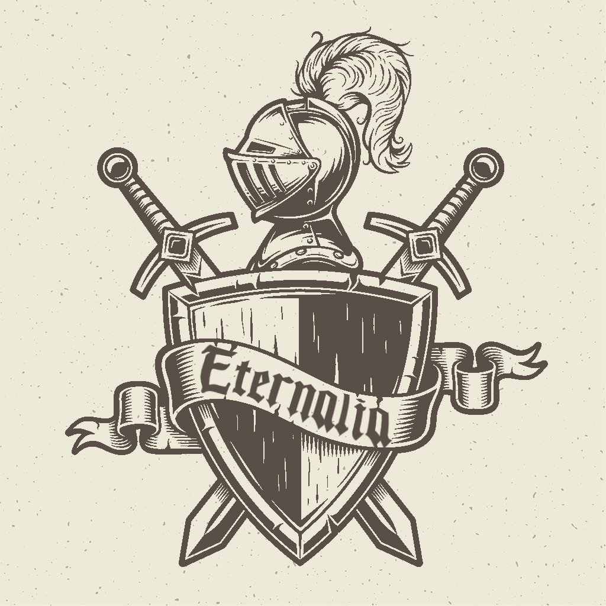

<html lang="en">

<head>
    <meta charset="UTF-8">
    <title>Province of Eternalia</title>
    <meta content="width=device-width, initial-scale=1.0" name="viewport">

    <link rel="stylesheet" href="https://cdnjs.cloudflare.com/ajax/libs/meyer-reset/2.0/reset.min.css">
    <link rel="stylesheet" href="{{ "/eternalia/fonts/ancient/ancientmedium.css" | absolute_url }}">

    <!-- Primary Meta Tags -->
    <meta name="title" content="Province of Eternalia">
    <meta name="description" content="Province of Eternalia">

    <!-- Open Graph / Facebook -->
    <meta property="og:type" content="website">
    <meta property="og:url" content="{{ "/eternalia/" | absolute_url }}">
    <meta property="og:title" content="Province of Eternalia">
    <meta property="og:description" content="Province of Eternalia">
    <meta property="og:image" content="{{ "/eternalia/logo.png" | absolute_url }}">

    <!-- Twitter -->
    <meta property="twitter:card" content="summary_large_image">
    <meta property="twitter:url" content="{{ "/eternalia/" | absolute_url }}">
    <meta property="twitter:title" content="Province of Eternalia">
    <meta property="twitter:description" content="Province of Eternalia">
    <meta property="twitter:image" content="{{ "/eternalia/logo.png" | absolute_url }}">

    <!--Favicon Information-->
    <link rel="apple-touch-icon" sizes="180x180" href="{{ "/eternalia/favicon/apple-touch-icon.png" | absolute_url }}">
    <link rel="icon" type="image/png" sizes="32x32" href="{{ "/eternalia/favicon/favicon-32x32.png" | absolute_url }}">
    <link rel="icon" type="image/png" sizes="16x16" href="{{ "/eternalia/favicon/favicon-16x16.png" | absolute_url }}">
    <link rel="manifest" href="{{ "/eternalia/favicon/site.webmanifest" | absolute_url }}">
    <link rel="mask-icon" href="{{ "/eternalia/favicon/safari-pinned-tab.svg" | absolute_url }}" color="#000000">
    <link rel="shortcut icon" href="{{ "/eternalia/favicon/favicon.ico" | absolute_url }}">
    <meta name="msapplication-TileColor" content="#000000">
    <meta name="msapplication-config" content="{{ "/eternalia/favicon/browserconfig.xml" | absolute_url }}">
    <meta name="theme-color" content="#ffffff">

    <!-- Google Fonts -->
    <link href="https://fonts.googleapis.com/css?family=Open+Sans:300,300i,400,400i,600,600i,700,700i|Raleway:300,300i,400,400i,500,500i,600,600i,700,700i|Poppins:300,300i,400,400i,500,500i,600,600i,700,700i" rel="stylesheet">

    <!-- Vendor CSS Files -->
    <link href="{{ "vendor/bootstrap/css/bootstrap.min.css" | absolute_url }}" rel="stylesheet">
    <link href="{{ "vendor/icofont/icofont.min.css" | absolute_url }}" rel="stylesheet">
    <link href="{{ "vendor/remixicon/remixicon.css" | absolute_url }}" rel="stylesheet">
    <link href="{{ "vendor/boxicons/css/boxicons.min.css" | absolute_url }}" rel="stylesheet">
    <link href="{{ "vendor/owl.carousel/assets/owl.carousel.min.css" | absolute_url }}" rel="stylesheet">
    <link href="{{ "vendor/venobox/venobox.css" | absolute_url }}" rel="stylesheet">
    <link href="{{ "vendor/aos/aos.css" | absolute_url }}" rel="stylesheet">

    <!-- Template Main CSS File -->
    <link href="style.css" rel="stylesheet">
    <link href="dark.css" rel="stylesheet">
</head>

<body class="d-flex flex-column min-vh-100">
    

    <!-- Page Preloder -->
    

        

    

     
     

    

        
    

    <main id="main">

        

            <h2>Eternalia</h2>
            
The First Province

        

        

            <a class="btn btn-lg btn-light" href="https://docs.google.com/document/d/1beiDnb_f4y6nIPE5HBP7d1KKZZv2-JkMUvMhQALY0oY/edit?usp=sharing">Constitution</a>
            <a class="btn btn-lg btn-light" href="https://docs.google.com/presentation/d/1U7qOMFv8u_U1RpXKXRotvwoi6o-LIJ35LtRrch_biRw/edit?usp=sharing">Borders</a>
            <a class="btn btn-lg btn-light" href="https://docs.google.com/document/d/1zy2dZtd0h-fD_dw5-xj5qwY6CqL1kj1hu3Ytfag6ZzY/edit?usp=sharing">Royal Guard</a>
            <a class="btn btn-lg btn-light" href="faq/">FAQ</a>
        

    </main>
     
    <!-- End #main -->

    <!-- ======= Footer ======= -->
    <footer id="footer" class="mt-auto">
        

            

                

                    <nav class="footer-links text-lg-right text-center pt-2 pt-lg-0">
                        
                    </nav>
                

            

        

    </footer>
    <!-- End Footer -->

    <!-- Vendor JS Files -->
    
    
    
    
    
    
    
    
    

    <!-- Template Main JS File -->
    
</body>

</html>
