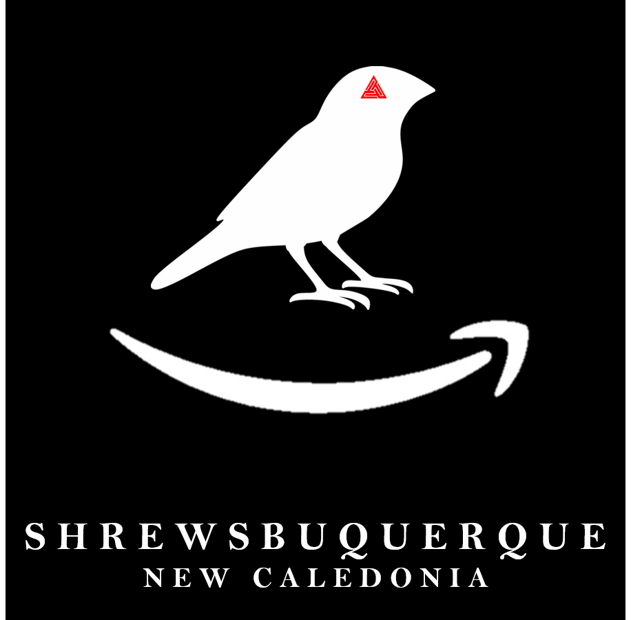

<html lang="en">

<head>
    <meta charset="utf-8">
    <meta content="width=device-width, initial-scale=1.0" name="viewport">

    <!-- Primary Meta Tags -->
    <title>Shrewsbuquerque - Frequently Asked Questions</title>
    <meta name="title" content="Shrewsbuquerque - Frequently Asked Questions">
    <meta name="description" content="Shrewsbuquerque: The superior province of Darzos">

    <!-- Open Graph / Facebook -->
    <meta property="og:type" content="website">
    <meta property="og:url" content="{{ "/shrewsbuquerque/faq/" | absolute_url }}">
    <meta property="og:title" content="Shrewsbuquerque - Frequently Asked Questions">
    <meta property="og:description" content="Shrewsbuquerque: The superior province of Darzos">
    <meta property="og:image" content="{{ "/shrewsbuquerque/logo/logo.png" | absolute_url }}">

    <!-- Twitter -->
    <meta property="twitter:card" content="summary_large_image">
    <meta property="twitter:url" content="{{ "/shrewsbuquerque/faq/" | absolute_url }}">
    <meta property="twitter:title" content="Shrewsbuquerque - Frequently Asked Questions">
    <meta property="twitter:description" content="Shrewsbuquerque: The superior province of Darzos">
    <meta property="twitter:image" content="{{ "/shrewsbuquerque/logo/logo.png" | absolute_url }}">

    <!-- Google Fonts -->
    <link href="https://fonts.googleapis.com/css?family=Open+Sans:300,300i,400,400i,600,600i,700,700i|Raleway:300,300i,400,400i,500,500i,600,600i,700,700i|Poppins:300,300i,400,400i,500,500i,600,600i,700,700i" rel="stylesheet">

     <!-- Vendor CSS Files -->
    <link href="{{ "vendor/bootstrap/css/bootstrap.min.css" | absolute_url }}" rel="stylesheet">
    <link href="{{ "vendor/icofont/icofont.min.css" | absolute_url }}" rel="stylesheet">
    <link href="{{ "vendor/remixicon/remixicon.css" | absolute_url }}" rel="stylesheet">
    <link href="{{ "vendor/boxicons/css/boxicons.min.css" | absolute_url }}" rel="stylesheet">
    <link href="{{ "vendor/owl.carousel/assets/owl.carousel.min.css" | absolute_url }}" rel="stylesheet">
    <link href="{{ "vendor/venobox/venobox.css" | absolute_url }}" rel="stylesheet">
    <link href="{{ "vendor/aos/aos.css" | absolute_url }}" rel="stylesheet">

    <!-- Template Main CSS File -->
    <link href="../style.css" rel="stylesheet">
    <link href="../dark.css" rel="stylesheet">

    <!--Favicon Information-->
    <link rel="apple-touch-icon" sizes="180x180" href="{{ "/shrewsbuquerque/favicon/apple-touch-icon.png?v=BGa3lqj5lG" | absolute_url }}">
    <link rel="icon" type="image/png" sizes="32x32" href="{{ "/shrewsbuquerque/favicon/favicon-32x32.png?v=BGa3lqj5lG" | absolute_url }}">
    <link rel="icon" type="image/png" sizes="16x16" href="{{ "/shrewsbuquerque/favicon/favicon-16x16.png?v=BGa3lqj5lG" | absolute_url }}">
    <link rel="manifest" href="{{ "/shrewsbuquerque/favicon/site.webmanifest?v=BGa3lqj5lG" | absolute_url }}">
    <link rel="mask-icon" href="{{ "/shrewsbuquerque/favicon/safari-pinned-tab.svg?v=BGa3lqj5lG" | absolute_url }}" color="#000000">
    <link rel="shortcut icon" href="{{ "/shrewsbuquerque/favicon/favicon.ico?v=BGa3lqj5lG" | absolute_url }}">
    <meta name="msapplication-TileColor" content="#000000">
    <meta name="msapplication-config" content="{{ "/shrewsbuquerque/favicon/browserconfig.xml?v=BGa3lqj5lG" | absolute_url }}">
    <meta name="theme-color" content="#ffffff">

    
</head>

<body class="dark-mode d-flex flex-column min-vh-100">
    

    <!-- Page Preloder -->
    

        

    

    <nav aria-label="breadcrumb">
        <ol class="breadcrumb">
            <li class="breadcrumb-item"><a href="../">Home</a></li>
            <li class="breadcrumb-item active" aria-current="page">Frequently Asked Questions</li>
        </ol>
    </nav>

    

        
    

    

        <!-- ======= Frequently Asked Questions Section ======= -->
        

            

                

                    <h2>Frequently Asked Questions</h2>
                    
About all things relating to Shrewsbuquerque

                

                

                    <ul>
                        <li data-aos="fade-up">
                            <a data-bs-toggle="collapse" data-bs-target="#faq-list-1" class="collapsed">I want a job, where can I get one? <i class="bx bx-chevron-down icon-show"></i><i class="bx bx-chevron-up icon-close"></i></a>
                            

                                

                                    If you want a government job, go to #job-postings and see what positions are open, then check
                                    #city-documents for the proper application, apply, and if you get accepted you will most likely
                                    do an interview. If you want a private job, find one of our business owners and ask them about a job, they will most likely have an applications as well and other requirements, depending on the job.
                                

                            

                        </li>
                        <!-- End F.A.Q Item-->

                        <li data-aos="fade-up" data-aos-delay="200">
                            <a data-bs-toggle="collapse" data-bs-target="#faq-list-2" class="collapsed">I was banned in the province, how do I get unbanned? <i class="bx bx-chevron-down icon-show"></i><i class="bx bx-chevron-up icon-close"></i></a>
                            

                                

                                    Constantly asking an admin or one of the senior staff/officials isn't the way to go, eventually, we will have an appeals center where you can appeal your ban. For now, kindly ask an admin to be unbanned.
                                

                            

                        </li>
                        <!-- End F.A.Q Item-->

                        <li data-aos="fade-up" data-aos-delay="300">
                            <a data-bs-toggle="collapse" data-bs-target="#faq-list-3" class="collapsed">I want to join, but I'm not a member of Darzos, am I still good? <i class="bx bx-chevron-down icon-show"></i><i class="bx bx-chevron-up icon-close"></i></a>
                            

                                

                                    Eternalia is a theocracy run by the church of Darzos, but that does not mean you must be a member of the church to join.
                                

                            

                        </li>
                        <!-- End F.A.Q Item-->

                        <li data-aos="fade-up" data-aos-delay="400">
                            <a data-bs-toggle="collapse" data-bs-target="#faq-list-4" class="collapsed">What kind of credits does the bank use since it doubles what I have? <i class="bx bx-chevron-down icon-show"></i><i class="bx bx-chevron-up icon-close"></i></a>
                            

                                

                                    We work on darzodian credits, which are worth half that of a national galactic credit, hence the reason your money is seemingly doubled.
                                

                            

                        </li>
                        <!-- End F.A.Q Item-->

                        <li data-aos="fade-up" data-aos-delay="500">
                            <a data-bs-toggle="collapse" data-bs-target="#faq-list-5" class="collapsed">How does the bank bot work? <i class="bx bx-chevron-down icon-show"></i><i class="bx bx-chevron-up icon-close"></i></a>
                            

                                

                                    Using "PBB!" as the prefix, you can type in help and get a list of usable commands, but only Alex and Nate of SFC can access the admin commands.
                                

                            

                        </li>
                        <!-- End F.A.Q Item-->

                    </ul>
                

            

        

        <!-- End F.A.Q Item-->
        <!-- End F.A.Q Section -->
    

    <!-- End #main -->

    <!-- ======= Footer ======= -->
    <footer id="footer" class="mt-auto">
        

            

                

                    <nav class="footer-links text-lg-right text-center pt-2 pt-lg-0">
                        
                    </nav>
                

            

        

    </footer>
    <!-- End Footer -->

    <!-- Vendor JS Files -->
    
    
    
    
    
    
    
    
    

    <!-- Template Main JS File -->
    

