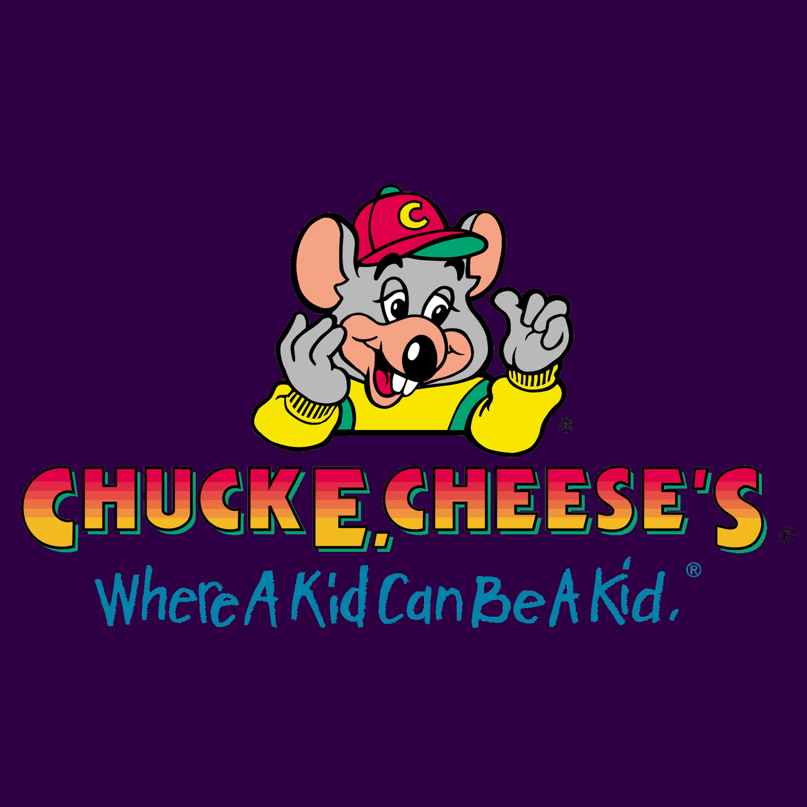

<html lang="en">

<head>
    <meta charset="utf-8">
    <title>FAQ - State of Cheese</title>
    <meta content="width=device-width, initial-scale=1.0" name="viewport">

    <!-- Primary Meta Tags -->
    <meta name="title" content="State of Cheese - FAQ">
    <meta name="description" content="State of Cheese - FAQ">

    <!-- Open Graph / Facebook -->
    <meta property="og:type" content="website">
    <meta property="og:url" content="{{ "/stateofcheese/faq/" | absolute_url }}">
    <meta property="og:title" content="State of Cheese - FAQ">
    <meta property="og:description" content="State of Cheese - FAQ">
    <meta property="og:image" content="{{ "/stateofcheese/logo.png" | absolute_url }}">

    <!-- Twitter -->
    <meta property="twitter:card" content="summary_large_image">
    <meta property="twitter:url" content="{{ "/stateofcheese/faq/" | absolute_url }}">
    <meta property="twitter:title" content="State of Cheese - FAQ">
    <meta property="twitter:description" content="State of Cheese - FAQ">
    <meta property="twitter:image" content="{{ "/stateofcheese/logo.png" | absolute_url }}">

    <!--Favicon Information-->
    <link rel="apple-touch-icon" sizes="180x180" href="{{ "/stateofcheese/favicon/apple-touch-icon.png" | absolute_url }}">
    <link rel="icon" type="image/png" sizes="32x32" href="{{ "/stateofcheese/favicon/favicon-32x32.png" | absolute_url }}">
    <link rel="icon" type="image/png" sizes="16x16" href="{{ "/stateofcheese/favicon/favicon-16x16.png" | absolute_url }}">
    <link rel="manifest" href="{{ "/stateofcheese/favicon/site.webmanifest" | absolute_url }}">
    <link rel="mask-icon" href="{{ "/stateofcheese/favicon/safari-pinned-tab.svg" | absolute_url }}" color="#000000">
    <link rel="shortcut icon" href="{{ "/stateofcheese/favicon/favicon.ico" | absolute_url }}">
    <meta name="msapplication-TileColor" content="#000000">
    <meta name="msapplication-config" content="{{ "/stateofcheese/favicon/browserconfig.xml" | absolute_url }}">
    <meta name="theme-color" content="#ffffff">

    <!-- Google Fonts -->
    <link href="https://fonts.googleapis.com/css?family=Open+Sans:300,300i,400,400i,600,600i,700,700i|Raleway:300,300i,400,400i,500,500i,600,600i,700,700i|Poppins:300,300i,400,400i,500,500i,600,600i,700,700i" rel="stylesheet">

    <!-- Vendor CSS Files -->
    <link href="{{ "vendor/bootstrap/css/bootstrap.min.css" | absolute_url }}" rel="stylesheet">
    <link href="{{ "vendor/icofont/icofont.min.css" | absolute_url }}" rel="stylesheet">
    <link href="{{ "vendor/remixicon/remixicon.css" | absolute_url }}" rel="stylesheet">
    <link href="{{ "vendor/boxicons/css/boxicons.min.css" | absolute_url }}" rel="stylesheet">
    <link href="{{ "vendor/owl.carousel/assets/owl.carousel.min.css" | absolute_url }}" rel="stylesheet">
    <link href="{{ "vendor/venobox/venobox.css" | absolute_url }}" rel="stylesheet">
    <link href="{{ "vendor/aos/aos.css" | absolute_url }}" rel="stylesheet">

    <!-- Template Main CSS File -->
    <link href="../style.css" rel="stylesheet">
    <link href="../dark.css" rel="stylesheet">

    
</head>

<body class="d-flex flex-column min-vh-100">
    

    <!-- Page Preloder -->
    

        

    

    <nav aria-label="breadcrumb">
        <ol class="breadcrumb">
            <li class="breadcrumb-item"><a href="../">Home</a></li>
            <li class="breadcrumb-item active" aria-current="page">Frequently Asked Questions</li>
        </ol>
    </nav>

    

        
    

    <main id="main">
        <!-- ======= Frequently Asked Questions Section ======= -->
        <section id="faq" class="faq section-bg">
            

                

                    <h2>Frequently Asked Questions</h2>
                    
About all things relating to State of Cheese

                

                

                    <ul>
                        <li data-aos="fade-up">
                            <a data-bs-toggle="collapse" data-bs-target="#faq-list-1" class="collapsed">Are you a knockoff Chuck E Cheese? <i class="bx bx-chevron-down icon-show"></i><i class="bx bx-chevron-up icon-close"></i></a>
                            

                                

                                    No, we are the one true establishment that all others strive to be.
                                

                            

                        </li>
                        <!-- End F.A.Q Item-->

                        <li data-aos="fade-up" data-aos-delay="200">
                            <a data-bs-toggle="collapse" data-bs-target="#faq-list-2" class="collapsed">Does Chuck E Cheese want to take over the the world?<i class="bx bx-chevron-down icon-show"></i><i class="bx bx-chevron-up icon-close"></i></a>
                            

                                

                                    We don't want to, we already have, and the world is a much better place now.
                                

                            

                        </li>
                        <!-- End F.A.Q Item-->

                        <li data-aos="fade-up" data-aos-delay="300">
                            <a data-bs-toggle="collapse" data-bs-target="#faq-list-3" class="collapsed">Why is there an overwelming amount of cheese outside of my door? <i class="bx bx-chevron-down icon-show"></i><i class="bx bx-chevron-up icon-close"></i></a>
                            

                                

                                    They beckon you to join the greatest conquest and become a citizen NOW!
                                

                            

                        </li>
                        <!-- End F.A.Q Item-->

                        <li data-aos="fade-up" data-aos-delay="400">
                            <a data-bs-toggle="collapse" data-bs-target="#faq-list-4" class="collapsed">What's a Super Rat? <i class="bx bx-chevron-down icon-show"></i><i class="bx bx-chevron-up icon-close"></i></a>
                            

                                

                                    A Super Rat is a team of Rats given heightened strength in order to enforce our perfect law.
                                

                            

                        </li>
                        <!-- End F.A.Q Item-->

                        <li data-aos="fade-up" data-aos-delay="500">
                            <a data-bs-toggle="collapse" data-bs-target="#faq-list-5" class="collapsed">How much does a party cost? <i class="bx bx-chevron-down icon-show"></i><i class="bx bx-chevron-up icon-close"></i></a>
                            

                                

                                    Prices are subject to change based on the daily sacrifice and are only guaranteed after the party has been successfully book.
                                

                            

                        </li>
                        <!-- End F.A.Q Item-->
                        
                        <li data-aos="fade-up" data-aos-delay="600">
                            <a data-bs-toggle="collapse" data-bs-target="#faq-list-6" class="collapsed">Is there an age limit on having a party at Chuck E. Cheese?  <i class="bx bx-chevron-down icon-show"></i><i class="bx bx-chevron-up icon-close"></i></a>
                            

                                

                                    At Chuck E. Cheese, we welcome everyone at any age!
                                

                            

                        </li>
                        <!-- End F.A.Q Item-->
                        
                        <li data-aos="fade-up" data-aos-delay="700">
                            <a data-bs-toggle="collapse" data-bs-target="#faq-list-7" class="collapsed">Is the current CEO of the State of Cheese insane? <i class="bx bx-chevron-down icon-show"></i><i class="bx bx-chevron-up icon-close"></i></a>
                            

                                

                                    Possibly but as current notions, No. As a mentally unwell CEO would be unfit to run this Company.
                                

                            

                        </li>
                        <!-- End F.A.Q Item-->

                    </ul>
                

        <!-- End F.A.Q Item-->

        

        </section>
        <!-- End F.A.Q Section -->
    </main>
    <!-- End #main -->

    <!-- ======= Footer ======= -->
    <footer id="footer" class="mt-auto">
        

            

                

                    <nav class="footer-links text-lg-right text-center pt-2 pt-lg-0">
                        
                    </nav>
                

            

        

    </footer>
    <!-- End Footer -->

    <!-- Vendor JS Files -->
    
    
    
    
    
    
    
    
    

    <!-- Template Main JS File -->
    
</body>

</html>
